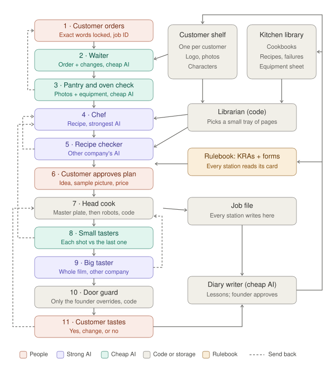

# P1 v2 — build specification

Written 2026-09-23 with the founder. This is the document a builder follows to rebuild P1. Read it end to end before
writing code. The standard it serves is `P1-MISSION-ADDENDUM.md` (founder's words; it wins any disagreement). The founder
will judge the finished build against `P1-V2-FOUNDER-CHECKLIST.md`, **before any money is spent on live tests**.

---

## 0. Rules for the builder (read first)

1. **No spend.** Build and test only in simulated mode (`MI_PROVIDER_MODE=simulated`, `MI_REASONING_MODE=simulated`, the
   defaults). No paid model, image, video or music call. No `--live` flags.
2. **No cloud changes.** Create, change or delete nothing on Azure, GCP or AWS. Never touch Azure subscription `d3ee8dc2`
   (Wherehouse) or resource group `project-1`.
3. **No merge to `main`.** Work on branch `claude/p1-v2-build` (create it from `claude/p1-v2-build-spec`). Open a **draft** PR.
4. **You are the builder, never the operator.** Nothing you write may let a builder, a script or an AI override a check,
   pick a take, or release a file. Only the founder can override (§6.4) — enforce it in code and test it.
5. **Evidence over claims.** Every checklist item you tick must point at a file, test or command output.
6. **Test first.** Write the failing test, then the code. The 23-September failures in §11 must each become a test.
7. **Reuse before rewrite.** P1 v1 (`product/`, 54 passing tests) has solid parts; §12 says what to keep.
8. **Stop and ask** if something here is ambiguous or seems wrong. Do not invent a design decision the founder has not made.
9. **Mac has 8 GB RAM.** Do not run parallel heavy test suites or many sub-agents at once.
10. **Report back** by filling `P1-V2-FOUNDER-CHECKLIST.md` (§14).

---

## 1. Why v2 exists (the evidence in one paragraph)

On 2026-09-23 P1 v1 ran two live jobs. A Mokobara poster was **accepted** (USD 2.28 — of which USD 1.87 was AI reasoning).
A 30-second Reel was **rejected** (USD 13.59): "two random hands, too many AI slops, robotic; the yellow colour is changing."
The independent review found: (a) nothing checked whether the product photos showed the parts the plan needed, or whether
the video model could perform the planned actions (hands working zips and flaps, 8 times in a row); (b) every shot was
generated independently, so the bag, room and sleeves changed between shots; (c) the system's own checkers **caught** the
problems — the recipe checker predicted them, the per-shot inspector rejected 12/13 stills and 15/16 clips, the job stopped
itself at USD 4.30 — but the builder, acting as operator, overrode them and pushed the film through; (d) no lesson was saved.
Evidence: private repo `chawlavaibhav/mi-p1-evidence`; entry point `coordination/p1/P1-REVIEW-ENTRY.md`.

**v2's job:** add the missing pantry-and-oven check, make one owner hold continuity, make checkers' "no" binding, give every
worker a rulebook card, store what the kitchen learns and feed it back, and cut AI cost by giving each worker only what it needs.

---

## 2. The structure



How to read it:
- **Left column:** one order's journey, stations 1→11, top to bottom.
- **Dashed lines:** send-back routes (§6.2). A station that says "no" returns the order to an earlier station.
  The line from 11 means a customer change: the waiter classifies it (Change request form) and only the affected station
  redoes work — usually the head cook.
- **Right column:** where things are kept (§7). The **librarian** hands the chef and recipe checker a small tray (§8).
  Every station reads its own card from the **rulebook** and writes to the **job file**. After the customer's verdict the
  **diary writer** proposes lessons; once the founder approves, they update the shelves, library and rulebook.
- **Colours:** coral = people; purple = strong AI; green = cheap AI; grey = plain code or storage; amber = rulebook.
  Purple (strong) workers: chef (company A); recipe checker and big taster (company B).

---

## 3. The workers

There are **2 people, 7 AI workers, 5 code helpers and 3 generators**. Seven AI workers run on about **three model
"brains"**: strong model A (chef), strong model B from a **different company** (big taster, recipe checker), cheap model(s)
(everyone else). Models are configuration, never hard-coded (§9).

Every AI worker's call is built from: its **rulebook card** (§5) + its **input form(s)** + its **tray** (if any) + the
**customer's exact words** (always). Each returns exactly one **output form** (§4), validated against a JSON schema.

| # | Worker | Kind | Model tier | Calls per job (cap) | Reads | Writes (form) | Can send back to |
|---|---|---|---|---|---|---|---|
| 1 | Customer | person | — | — | — | Order slip | — |
| 2 | Waiter | AI | cheap | 1 (+1 after answers; +1 per change request) | Order slip, photos, customer shelf | Understanding; Change request | Customer (questions) |
| 3 | Pantry and oven checker | AI + code | cheap vision + code rules | 1 vision call + rules | Understanding, photos, customer shelf, equipment sheet | Feasibility | Customer (need photo/fact) or Waiter (offer alternative) |
| 4 | Chef | AI | strongest | 1 (max 2) | Understanding, Feasibility, tray | Recipe | — |
| 5 | Recipe checker | AI + code | strong, other company | 1 (max 2) | Customer's words, Understanding, Feasibility, Recipe, tray (failures heavy) | Recipe check | Chef |
| 6 | Customer | person | — | — | Plan card, sample picture, quote | Approve / change | Waiter |
| 7 | Head cook | code | none | 0 AI calls | Recipe, customer shelf | Production log | — |
| 8 | Small taster | AI + code | cheap vision; escalates to strong when unsure | 1 per picture/clip | Customer's words, shot instruction, master plate, previous plate, measurements | Ingredient check | Head cook (retry) / Chef (re-plan) |
| 9 | Big taster | AI + code | strong vision, other company | 1 per finished cut | Customer's words, Understanding, finished file, measurements | Final review | Head cook (fix shots) / Chef (recipe wrong) |
| 10 | Door guard | code | none | 0 | All checks for the exact file | Gateway report | — |
| 11 | Customer | person | — | — | Preview + plain check report | Accept / change / reject | Waiter |
| — | Diary writer | AI | cheap, run after the job, batch pricing | 1 per closed job (accepted, rejected or abandoned) | Whole job file + verdict | Lessons (proposals) | — |
| — | Librarian | code | none (optional cheap embedding) | 0 | Library + shelf | Tray | — |
| — | Sign painter (compositor) | code | none | 0 | Recipe copy deck, brand fonts/colours | Composed text/logo layers | — |
| — | Measuring tools | code | none | 0 | Files | Deterministic checks | — |
| — | Founder (operator) | person | — | — | Everything | Overrides with written reason | Anything |
| — | Generators | external | picture / video / music models | per route | Head cook's requests | Media | — |

Section 5 gives each worker's mission and KRA.

---

## 4. The forms

Forms are JSON schemas in one module (today `product/contracts.py`). Every form carries `job_id`, `form_version`,
`written_by` (worker + model id), `rulebook_card_version`, and `created_utc`. All forms are stored in the job file (§7.1),
versioned, never overwritten.

### 4.1 Order slip (customer, web form) — keep v1 fields, plus:
- `customer_exact_words` — the brief text, **stored once, never edited by anyone**, passed to every AI worker.
- `photos[]` each with an optional customer label, **and** a system role label added by the waiter (§4.2), checked by the pantry checker (§4.3).

### 4.2 Understanding (waiter) — v1 `INTENT` fields, plus:
- `customer_exact_words` (copied, read-only; validated byte-equal to the order slip).
- `photo_roles[]` — for each supplied photo: `product_view | product_detail | lifestyle | infographic | logo | other`, and
  what it shows (e.g. "front, closed", "front pocket open, bag lying flat, with text labels").
- `mismatches[]` — anything in the order that contradicts the photos or itself (the v1 film's photo note was wrong; no one noticed).

### 4.3 Feasibility (pantry and oven checker) — **new**
- `product_truth[]` — every product part/state the order needs (e.g. "front pocket open", "laptop compartment opening"),
  each with `covered_by_photo: yes/no`, `photo_ref`, `source: photo | customer_fact | none`.
- `actions_needed[]` — every physical action the order implies (e.g. "hands pull zips along a curved track").
- `route_verdicts[]` — for each action: which routes (§9) can do it, looked up in the equipment sheet:
  `reliable | risky | cannot`, with the equipment-sheet row id as evidence.
- `verdict: go | go_with_limits | need_input | cannot_make`.
- `ask_customer[]` — plain-English requests ("Please send a photo of the laptop compartment open").
- `alternatives[]` — if something cannot be made, the nearest dish that can ("show the pocket open as a still, not as an action").
- **Binding rule:** the chef may only plan actions/routes marked `reliable` or `risky`; `risky` ones must be the first shot
  qualified (§6.3). `need_input` pauses the job for the customer. `cannot_make` goes back to the waiter with alternatives.

### 4.4 Recipe (chef) — v1 `DIRECTION` + `BEAT` fields, plus:
- Per shot: `route` (from the allowed list), `action_class` (the equipment-sheet category), `starts_from`
  (`master_plate` | `previous_shot_end` | `still_only`), `feasibility_refs[]`.
- `library_used[]` — ids of the cookbook pages, past recipes and failures on the tray that shaped a decision.
- `risks[]` must include every `risky` action from Feasibility and how the plan limits it.

### 4.5 Recipe check (recipe checker) — v1 `DIRECTION_REVIEW`, changed:
- `verdict: approve | add_steps | send_back`. `add_steps` lists concrete additions the chef must apply; `send_back` returns
  to the chef with reasons. **Any `major` or `blocker` issue, and any feasibility risk the recipe ignores, forces `send_back`.**
- `predicted_acceptance: likely | uncertain | unlikely` with the reason, judged against `customer_exact_words`.
- `past_failures_matched[]` — failure-diary ids that apply to this recipe.

### 4.6 Production log (head cook, code) — **new**
Master plate id and approval, each shot's source image, previous-shot link, route, attempts, selected take, reason.

### 4.7 Ingredient check (small taster) — v1 `INSPECT`, plus:
- `matches_previous_plate: yes | no | n/a` with differences listed (product shape, colour, room, light, wardrobe).
- `matches_master_plate: yes | no`.
- Receives `customer_exact_words` (v1 did not).

### 4.8 Final review (big taster) — v1 `OUTPUT_REVIEW` unchanged in shape; `verdict: pass | fix | fail`;
defects carry `earliest_stage` so the router knows where to send the job.

### 4.9 Change request (waiter) — v1 `REVISION` (the separate change-taker is merged into the waiter).

### 4.10 Gateway report (door guard, code) — v1 shape; overrides only by the founder (§6.4).

### 4.11 Lessons (diary writer) — **new**
Per job: `outcome`, `what_the_customer_said`, and per worker `{worker, what_went_right, what_went_wrong, evidence_refs,
proposed_change: {target: rulebook_card | equipment_sheet | recipe_library | failure_diary | customer_shelf | form, diff}}`.
Proposals wait in a queue; nothing changes until the founder approves each one (§7.6).

### 4.12 Rulebook card (per worker) — **new**, see §5.

---

## 5. Rulebook cards: mission, vision, KRA

Stored in the rulebook (§7.5), versioned; each AI call includes its worker's current card, and the card version is recorded
on the form. Draft cards below; the builder stores them as data files, not as strings buried in code.

**Waiter**
- Mission: hand the kitchen a complete order in the customer's own words.
- Vision: the customer never has to repeat themselves, and the kitchen never guesses what they meant.
- KRA: (1) every must-have in the customer's words appears in Understanding; (2) every photo is labelled with its role;
  (3) contradictions are raised, not smoothed over; (4) ask only questions that change the dish (≤ 5).
- Measured by: must-haves later found missing; customer changes caused by misunderstanding.

**Pantry and oven checker**
- Mission: never let the kitchen start a dish it lacks the ingredients or equipment for.
- Vision: no money is spent on a shot the equipment cannot make.
- KRA: (1) every product part/state the order needs is checked against a photo; (2) every action is checked against the
  equipment sheet; (3) missing truth becomes a precise request to the customer; (4) "cannot" always comes with an alternative.
- Measured by: shots that failed for a reason the equipment sheet already knew; jobs that paused needlessly.

**Chef**
- Mission: write the best dish the customer asked for that this kitchen can actually cook.
- Vision: an idea the audience remembers and the customer is proud of, executed within the kitchen's proven abilities.
- KRA: (1) every must-have placed in a specific shot; (2) only allowed routes and actions; (3) consult the tray and cite what
  was used; (4) one clear idea, not a list of features; (5) a continuity plan (master plate, shot-to-shot links).
- Measured by: recipes sent back; customer acceptance of the finished work; cost per accepted outcome.

**Recipe checker**
- Mission: predict whether the customer will accept this recipe, and stop it if not.
- Vision: bad recipes die on paper, where they cost nothing.
- KRA: (1) judge against the customer's exact words, not the chef's summary; (2) match past failures; (3) every issue has a
  concrete fix; (4) never approve a recipe that uses a `cannot` action.
- Measured by: agreement between `predicted_acceptance` and the customer's verdict (qualification, §10).

**Head cook (code)**
- Mission: one dish, one memory.
- KRA: master plate first and approved; every shot built from the master plate and the previous shot's end; never a third
  identical retry; every output written to a new, unique file path.

**Small taster**
- Mission: stop a bad ingredient before it costs more.
- KRA: (1) check each output against its instruction **and** the customer's words; (2) compare with the previous and master
  plates; (3) when unsure, escalate to the strong model; (4) its "no" is binding.
- Measured by: bad takes that reached the final cut; good takes wrongly rejected (qualification, §10).

**Big taster**
- Mission: judge the finished dish the way the customer will.
- KRA: (1) judge against the customer's exact words; (2) every defect has a timestamp, severity and earliest stage;
  (3) say `pass` only if you would accept it as the customer.
- Measured by: agreement with the customer's verdict (qualification, §10).

**Door guard (code)**
- Mission: nothing leaves with a failed or missing check. KRA: only the founder can override, with a reason, logged.

**Diary writer**
- Mission: every job teaches every role something.
- KRA: (1) a lesson for every closed job, including rejected and abandoned ones; (2) each lesson names the worker and cites
  evidence; (3) propose precise changes, never apply them.

**Sign painter (code)** — mission: the customer's words, exactly, legibly, in the brand's type. (Design quality is a separate
workstream; v2 keeps v1's measurable checks and adds brand fonts from the customer shelf.)

---

## 6. The flow

### 6.1 Happy path
1 Order → 2 Understanding (questions if needed) → 3 Feasibility → 4 Recipe (librarian tray) → 5 Recipe check →
6 customer approves plan + quote → 7 head cook: **master plate** (picture model) → small taster → founder/customer
approves the master plate for films → each shot from master + previous shot → 8 small taster per output → assembly +
sign painter + measuring tools → 9 big taster → 10 door guard → 11 customer preview → accept → delivery → diary writer.

### 6.2 Send-back rules (the dashed lines)
| From | Condition | Goes to | Limit |
|---|---|---|---|
| Waiter | ambiguity or missing must-have info | Customer (questions) | ≤ 5 questions, once |
| Pantry checker | `need_input` | Customer (photo/fact request) | job pauses, USD 0 spent |
| Pantry checker | `cannot_make` | Waiter → customer with alternatives | — |
| Recipe checker | `send_back` | Chef | 2 rounds, then the job pauses for the founder |
| Small taster | output rejected | Head cook retries that output | 2 attempts per output |
| Small taster | 2 rejected attempts on one output | Chef re-plans that shot (route/action change) | 1 re-plan per shot, then pause |
| Big taster | `fix` | Head cook redoes only the named shots | 2 rounds |
| Big taster | `fail` with `earliest_stage = plan` | Chef | 1 round |
| Big taster | 2 failed rounds | Job pauses; founder decides | — |
| Customer | change request | Waiter classifies → the affected station only | per quote |

**Never** send the same request to the same generator a third time. A retry must change something (route, source image,
instruction) and record what changed.

### 6.3 Riskiest shot first
Shots with `risky` actions are produced and checked first. If the riskiest shot fails its small-taster check twice, stop
before paying for the other shots (v1 did this correctly at USD 4.30 — keep it, and make it un-overridable except by the founder).

### 6.4 Overrides — founder only
- A small-taster "no", recipe-checker `send_back`, big-taster `fail/fix`, or any door-guard block can be overridden **only**
  by a user with role `founder`, through the operator UI, with a written reason. Stored in the job file.
- Scripts, the worker process, builders and AI workers cannot override. There is no environment flag or admin command that
  bypasses this. Test it (§11).
- v1's "unqualified inspector cannot kill a film" rule is removed. An unqualified checker's **no** still blocks; its **yes**
  counts only as "a person must confirm" until qualified (§10).

### 6.5 States
Keep v1's persisted state machine and leases; add states `awaiting_customer_input` (Feasibility), `awaiting_master_approval`,
`paused_for_founder`. Every state change is an event with actor and reason.

---

## 7. Storage

Five stores. Everything is plain files + SQLite so it is backup-able and readable. Every record carries a version and the job
id that created or changed it.

### 7.1 Job file (exists; fix and extend)
- **What:** one per job id: order slip, every form version, ledger (reserve/settle per attempt), events, timings, every
  generated and composed file, checks, overrides, verdicts, deliveries.
- **Where:** SQLite (`mi.sqlite3`) + `media/<job_id>/…`.
- **Fix:** every file gets a **unique path per version** (v1 overwrote the image job's first-cut posters). Files are write-once.
- **Who writes:** every station. **Who reads:** diary writer, operator view, customer (their own job only).

### 7.2 Customer shelf (new)
- **What:** per customer account: logo(s), brand colours, brand fonts (files), product catalogue (per product: photos with
  roles, facts, approved `product_anchor` text), approved characters (reference images + description), approved master plates,
  tone/do/don't notes, past jobs and verdicts.
- **Where:** SQLite tables (`shelf_items`, versioned) + `shelf/<account_id>/…` files.
- **Lifecycle:** filled by the first (onboarding) job and every later job; **the customer approves each item once**; new
  versions never delete old ones. A job records which shelf item versions it used.
- **Who reads:** waiter (pre-fill), pantry checker, librarian, head cook, sign painter. **Privacy:** an account sees only its shelf.

### 7.3 Kitchen library (partly exists)
| Section | What | Exists? | Source |
|---|---|---|---|
| Cookbooks | Canon: 10 adopted packs, ~1,300 claims | yes | `canon/` via `product/canon_access.py` |
| Failure diary | 225 historical rows / 104 modes + every new failure | exists but **never read during a job** | `production-learning/atlas/2026-09-22/`, `product/data/FAILURE-CONTROLS-v1.yaml` |
| Recipe library | every recipe with its outcome (accepted/rejected + customer words) and labels | **new** | written by the diary writer after approval |
| Equipment sheet | per generator × action class: `reliable / risky / cannot`, evidence refs, sample counts | **new** | seeded from the atlas + 23-Sep evidence (§9.2); updated by approved lessons |

Every library item carries **labels**: `media` (image/film), `product_category`, `action_class`, `route`, `outcome`,
`brand` (for customer-private items, never shown to other accounts), `source_job_id`.

### 7.4 Rulebook (new)
Rulebook cards (§5) and form schemas (§4), each versioned, in `product/rulebook/` as data files. Changes only through
approved lessons or a founder edit; every change logged with the reason.

### 7.5 Lesson queue (new)
Diary-writer proposals waiting for the founder. Operator UI: approve / edit / reject each. Approved lessons are applied by
code to the target store and recorded.

---

## 8. Retrieval (the librarian)

**Problem in v1:** the chef received all 10 Canon packs (~25,000 tokens) on every call; the failure atlas was never read.

**v2:** a code librarian builds a **tray** per worker, with a hard token cap:
1. **Filter** by labels (media, product category, action classes in the plan, routes allowed, customer account).
2. **Rank** by similarity to the order (start with BM25/keyword scoring as v1's `deep_retrieve` does; an embedding index
   may be added behind the same interface — optional, cheap, not required for v2).
3. **Keep the top items within the cap.**

| Tray for | Contents | Cap |
|---|---|---|
| Chef | ≤ 6 cookbook pages, 3 most similar past recipes **with outcomes**, failures matching planned action classes, this customer's shelf summary | ~6,000 tokens |
| Recipe checker | failures matching the recipe's action classes and routes, 3 similar recipes with outcomes, equipment rows used | ~4,000 tokens |
| Pantry checker | equipment-sheet rows for the order's action classes | ~1,500 tokens |

- The tray is logged in the job file (which ids were given), so later we can see what the chef knew.
- The library can grow without the tray growing; cost per job stays flat.
- Stable prefixes (rulebook card + schema) are placed first so provider-side prompt caching applies.

---

## 9. Routes, equipment sheet, models and cost

### 9.1 Production routes
| Route | What | Use for |
|---|---|---|
| IMG | picture model, 1 draw (+1 retry), words and logo by code | posters, product ads |
| FILM-A | approved stills + code motion (push, pan, parallax) | safest; any shot the video model can't do reliably |
| FILM-B | video model moves the camera around a product that doesn't change | reveals, product beauty |
| FILM-C | video model performs **one simple** hand action (lift, place, point) | only after it passes riskiest-shot qualification |
| Not offered | hands working zips/flaps/mechanisms, multi-step manipulation, talking, lip-sync, identifiable people | refuse or re-plan at the pantry check |

### 9.2 Equipment sheet (seed)
Seed rows from evidence (each cites its source); the builder stores them as data with `sample_count` and `evidence_refs`:
- Veo 3.1 Fast i2v — hands manipulating zips/flaps on a product → `cannot` (23-Sep film: 15/16 takes rejected; atlas mode
  `route_cannot_meet_the_demand`).
- Veo 3.1 Fast i2v — object inserted into a container → `risky` (not yet observed: beat 4 was refused by the provider; the
  risk is the recipe checker's written prediction, so `sample_count: 0`).
- Veo 3.1 Fast i2v — lift a closed product by the handle → `risky` (bag floated / began mid-air in both takes).
- Veo 3.1 Fast i2v on the Gemini API — audio is always generated; safety refusals labelled "audio issue" occurred on 2 beats → note.
- nano-banana-2 — product fidelity from a single clean product photo → `reliable` for stills (poster accepted);
  from an annotated infographic reference → `risky` (text-labelled diagrams confuse geometry; brand misspelt "mokebara").
- nano-banana-2 — legible brand text on the product → `cannot` (use code-composed text only).
- FILM-A code motion → `reliable`.
Rows not yet evidenced stay `unknown`, which the pantry checker treats as `risky`.

### 9.3 Models (configuration only)
| Tier | Workers | Requirement |
|---|---|---|
| Strongest | chef | best available creative reasoning; medium reasoning effort by default |
| Strong, other company | big taster; recipe checker | vision + long context; different vendor from the chef |
| Cheap | waiter, pantry checker (vision), small taster (vision), diary writer | cheapest model that passes the worker's tests |
| Decision-only (optional later) | yes/no classifications (e.g. change type, action class) | an adapter slot for a decision model such as Jev; not required for v2 |
Each worker's model is set in config (`MI_MODEL_<WORKER>`), with provider adapters for Azure OpenAI, Anthropic and Gemini
(v1 has all three transports).

### 9.4 Cost budgets (targets to measure, not promises)
- AI reasoning per **image** job: target ≤ USD 0.03 (v1 actual: USD 1.87). Per **film** job: target ≤ USD 0.30 (v1: USD 2.33).
- Levers: model tiers; trays instead of full Canon; one call per worker with caps; medium reasoning effort; no retries
  without a change; diary writer on batch pricing.
- The quote shown to the customer includes a reasoning line computed from these budgets; the ledger records actuals per worker.
- Simulated mode must report **estimated** reasoning cost per worker per job so budgets can be checked before any live run.

---

## 10. Qualification of the judges (build the harness; do not run it live)

The recipe checker, small taster and big taster only count as independent judges once they pass a test on cases where the
founder's verdict is already known. v1 has a harness (`product/qualification/`) — extend it to all three judges.

- **Dataset:** assemble from existing evidence (no new generation): the 23-Sep poster and film (all takes, both cuts,
  recipes, verdicts), Mokobara v1/v2, RentOK Lane A/B/V2, and the other accepted/rejected cases in `production-learning/`.
  Each item: input + known verdict + known defects.
- **Pass mark (proposed; founder to confirm):** recipe checker agrees with the known outcome on ≥ 80 %; small taster
  catches ≥ 80 % of known bad takes with ≤ 20 % false rejections; big taster finds ≥ 4 of 6 known MOKO7 v1 defects and agrees
  with the customer's verdict on ≥ 80 % of cuts.
- **Until qualified:** a judge's "no" blocks; its "yes" = "founder confirms".
- The harness must run in simulated mode for tests; the live run is a separate, founder-authorised step.

---

## 11. Tests that must exist (all simulated, USD 0)

Regression tests from the 23-September evidence (use the sanitized records in `mi-p1-evidence` as fixtures where useful):
1. **Backpack film recipe is blocked before spend:** the v1 film's order + photos + v1 recipe → the pantry checker marks
   "hands pull zips / fold flap" as `cannot`, and the chef cannot plan them; the job never reaches a paid call.
2. **Missing product truth pauses the job:** an order needing "front pocket open" with no photo of it → `need_input` with a
   customer request.
3. **Builder cannot override:** attempts to override a small-taster "no", a recipe `send_back`, a big-taster `fail`, or a
   gateway block with any non-founder actor (worker process, script, admin CLI, `operator:claude…`) are refused and logged.
4. **Founder can override** with a reason; the reason is stored and shown in the gateway report.
5. **Continuity:** every film shot's source image is the master plate or the previous shot's end frame (production log proves it).
6. **No third identical retry:** a third request to the same generator with the same inputs is refused.
7. **Big taster `fix` redoes only named shots;** `fail` twice pauses for the founder.
8. **Write-once files:** a recomposed deliverable never overwrites an earlier version (v1's lost posters).
9. **Diary on every outcome:** accepted, rejected and abandoned jobs each produce a Lessons form; nothing is applied until approved.
10. **Approved lessons change behaviour:** after approving an equipment-sheet lesson, the next simulated job's pantry check uses it.
11. **Customer's exact words** reach every AI worker unchanged (byte-equal check), including the small taster.
12. **Tray caps:** chef tray ≤ cap; tray ids logged; failure-diary items matching the plan's action classes are included.
13. **Customer shelf reuse:** a second job for the same account pre-fills from the shelf and reuses the approved character
    and master plate; another account cannot read it.
14. **Rulebook:** every AI call records the card version; changing a card via an approved lesson bumps the version.
15. **Cost report:** a simulated film job reports estimated reasoning cost per worker within the §9.4 budgets.
16. All existing v1 tests still pass or are consciously replaced (list any removed test and why).

---

## 12. Reuse vs rebuild

Keep (adapt, don't rewrite): `store.py`/`states.py` (ledger, leases, events), `dispatch.py`/`providers.py` (one paid path,
reserve-before-send), `media.py`/`compose.py` (ffmpeg, Pillow text, gates), `verify.py` gateway core, `web/` (customer +
operator), `admin.py`, deploy kit, the qualification harness, the simulated backends.

Restructure: `orchestrator.py` (1,105 lines) → split by station (`stations/waiter.py`, `pantry.py`, `chef.py`,
`recipe_check.py`, `head_cook.py`, `tasters.py`, `diary.py`) around one small flow controller that owns states and
send-back rules (§6.2). `contracts.py` → `rulebook/` (cards + schemas as data). `canon_access.py` → `library/` with the librarian.

Remove: the v1 path where an unqualified inspector cannot block a film (`15ab0a7`), and any operator path usable by a
non-founder.

Suggested layout (builder may refine, and must explain changes):
```
product/
  flow.py                # states + send-back rules (§6)
  stations/              # one module per worker (§3)
  rulebook/              # cards + form schemas, versioned data (§4, §5)
  library/               # librarian, cookbooks adapter, recipe library, failure diary, equipment sheet (§7.3, §8)
  shelf/                 # customer shelf (§7.2)
  lessons/               # diary writer + lesson queue (§7.5)
  store.py dispatch.py providers.py media.py compose.py verify.py web/ ...
```

---

## 13. Build order (each phase ends green before the next)

1. **Skeleton:** branch, layout, rulebook data files, form schemas, flow controller with states and send-back table; tests 3, 4, 6.
2. **Storage:** job file fixes (write-once), customer shelf, library sections, lesson queue; tests 8, 13.
3. **Front of house:** waiter (exact words, photo roles), pantry checker, equipment sheet seed; tests 1, 2, 11.
4. **Chef + librarian + recipe checker:** trays, binding send-back; test 12.
5. **Head cook + tasters + big taster + door guard:** master plate, shot chaining, retry rules, founder-only overrides;
   tests 5, 7.
6. **Diary writer + lessons applied:** tests 9, 10, 14.
7. **Cost report + qualification harness (simulated) + operator UI for founder overrides and lesson approval:** test 15.
8. **Full simulated journeys** (image and film) through the web app, then `product.smoke`; test 16; fill the checklist.

---

## 14. Report back

When done, update `P1-V2-FOUNDER-CHECKLIST.md`: for every item write **Done / Partly / Not done**, and the evidence (file,
test name, or command + output). Then list: open questions for the founder, anything in this spec you changed and why,
and the exact commands to reproduce your results. Leave the PR as a draft. Spend nothing.
